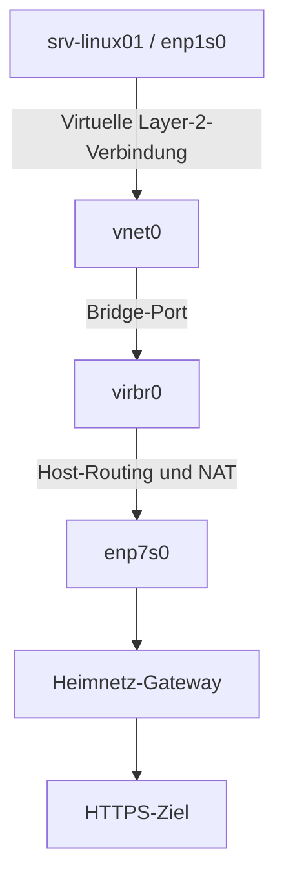

# IPv4-Paketweg durch ein libvirt-NAT-Netz

Dieses Labor wurde am 03.09.2026 als angeleitete praktische Übung durchgeführt. Untersucht wurde der funktionierende IPv4-Paketweg einer HTTPS-Verbindung von `srv-linux01` durch das libvirt-NAT-Netz und den Pop!_OS-Host. Es wurde kein unbekannter Fehler gesucht oder behoben.

## Ziel

Das Labor sollte zeigen:

* welche Route die VM für ein entferntes Ziel verwendet
* wie die VM über `vnet0` und `virbr0` mit dem Host verbunden ist
* welche Route der Host zum Ziel verwendet
* an welcher Stelle die NAT-Übersetzung sichtbar wird
* wie DNS-Konfiguration und Namensauflösung getrennt geprüft werden
* wie TCP-Verbindungsaufbau und Verbindungsbeendigung im Mitschnitt erscheinen

## Versuchsaufbau

| Bestandteil | Konfiguration oder Aufgabe |
|---|---|
| VM | `srv-linux01` mit `enp1s0` |
| VM-Netz | `192.168.122.0/24` |
| VM-Adresse | `192.168.122.156/24` |
| Standard-Gateway und DNS-Server der VM | `192.168.122.1` |
| Hostseitige VM-Schnittstelle | `vnet0` |
| libvirt-Bridge | `virbr0` |
| Externe Hostschnittstelle | `enp7s0` |
| Externe Quelladresse nach NAT | Hostadresse im Heimnetz |
| Nächstes Gateway | Heimnetz-Gateway |
| Verbindung | HTTPS über TCP-Port 443 |

`example.com` wurde am 03.09.2026 zur IPv4-Adresse `172.66.147.243` aufgelöst. Diese Adresse ist eine historische Momentaufnahme. Vor einer Wiederholung muss die aktuell aufgelöste IPv4-Adresse ermittelt und in den zielbezogenen Befehlen eingesetzt werden.

## Paketweg



Die VM und der Host treffen getrennte Routingentscheidungen:

1. Die VM prüft ihre eigene Routingtabelle. Das entfernte Ziel wird über die Default-Route und das Standard-Gateway `192.168.122.1` erreicht.
2. `vnet0` und `virbr0` stellen die Layer-2-Anbindung zwischen VM und Host her. `virbr0` entscheidet nicht über die IP-Route zum externen Ziel.
3. Der Host prüft seine eigene Routingtabelle und leitet das Paket über `enp7s0` zum Heimnetz-Gateway weiter.
4. Beim ausgehenden Verkehr übersetzt NAT die private Quell-IP-Adresse der VM in die Hostadresse im Heimnetz. Bei Bedarf kann NAT auch den Quellport ändern.

## Durchführung

### Routing der VM

Die Routingtabelle der VM wurde angezeigt:

```bash
ip route
```

Danach wurde die vom Kernel gewählte Route zur historischen Zieladresse abgefragt:

```bash
ip route get 172.66.147.243
```

`ip route get` zeigt die aufgelöste Route, beispielsweise Gateway, Ausgabeschnittstelle und bevorzugte Quelladresse. Der Befehl sendet selbst kein Testpaket und beweist daher keine Erreichbarkeit.

### DNS

Die DNS-Konfiguration von `enp1s0` wurde geprüft:

```bash
resolvectl status enp1s0
```

Anschließend wurde eine Namensauflösung durchgeführt:

```bash
resolvectl query example.com
```

Eine erfolgreiche DNS-Auflösung liefert eine Adresse zum Namen. Sie beweist noch nicht, dass der Netzwerkweg oder der Webdienst auf TCP-Port 443 erreichbar ist.

### IPv4-Nachbartabelle

Der Nachbareintrag des VM-Gateways wurde vor und nach einem Ping geprüft:

```bash
ip neigh show 192.168.122.1
ping -c 1 192.168.122.1
ip neigh show 192.168.122.1
```

Die IPv4-Nachbartabelle enthält die Zuordnung direkt erreichbarer IPv4-Nachbarn zu ihren Link-Layer-Adressen und den jeweiligen Zustand des Eintrags.

### HTTPS-Verbindung

Für den historischen Versuch wurde die zuvor aufgelöste Zieladresse fest vorgegeben:

```bash
curl -4 --resolve example.com:443:172.66.147.243 -I https://example.com
```

`--resolve` ordnet bei diesem Aufruf den angegebenen Host und Port der vorgegebenen Ziel-IP-Adresse zu. Die normale DNS-Auflösung für dieses Ziel wird dadurch bei diesem Aufruf umgangen.

### Routing und Mitschnitt auf dem Host

Die Adresse von `virbr0` und die Hostroute zum Ziel wurden geprüft:

```bash
ip -br address show virbr0
ip route get 172.66.147.243
```

Während des HTTPS-Aufrufs lief ein gemeinsamer Paketmitschnitt:

```bash
sudo tcpdump -nn -i any 'host 172.66.147.243 and tcp port 443'
```

`-i any` erfasst unter Linux Verkehr an allen verfügbaren Schnittstellen. Weitergeleiteter Verkehr derselben Verbindung kann dadurch an mehreren Beobachtungspunkten erscheinen.

## Beobachtungen

### Routing und Nachbartabelle

Die VM verwendete für das entfernte Ziel ihre Default-Route über `192.168.122.1`.

Der Nachbareintrag des Gateways befand sich zunächst im Zustand `DELAY`. Nach dem erfolgreichen Ping wurde er als `REACHABLE` angezeigt.

Die Hostroute zum Ziel verwendete `enp7s0` und das Heimnetz-Gateway.

### DNS

`resolvectl status enp1s0` zeigte `192.168.122.1` als DNS-Server der VM. Die Abfrage von `example.com` war erfolgreich.

Der anschließende HTTPS-Test verwendete die Zieladresse über `curl --resolve`. Im auf TCP-Port 443 begrenzten Mitschnitt wurden daher keine DNS-Pakete erfasst.

### Paketbeobachtung und NAT

| Beobachtungspunkt | Sichtbare ausgehende Quelladresse | Einordnung |
|---|---|---|
| `vnet0` | `192.168.122.156` | Verkehr auf der Hostseite der virtuellen VM-Anbindung |
| `virbr0` | `192.168.122.156` | Verkehr am virtuellen Netz des Hosts |
| `enp7s0` | Hostadresse im Heimnetz | Verkehr nach der NAT-Übersetzung |

Der weitergeleitete Verkehr derselben Verbindung erschien auf `vnet0`, `virbr0` und `enp7s0`. Durch NAT unterschieden sich dabei die sichtbaren Adressangaben.

Bei dieser einzelnen Verbindung blieb der beobachtete Quellport erhalten. Daraus folgt nicht, dass NAT den Quellport bei anderen Verbindungen grundsätzlich unverändert lässt.

Im Mitschnitt waren außerdem der TCP-Drei-Wege-Handshake und die geordnete Beendigung der TCP-Verbindung sichtbar.

## Schlussfolgerungen

Die Beobachtungen stützen für diesen Versuch folgende Einordnung:

* Die VM traf anhand ihrer Routingtabelle die erste Routingentscheidung.
* `vnet0` und `virbr0` stellten die Layer-2-Anbindung zwischen VM und Host her.
* Der Host traf eine eigene Routingentscheidung für die Weiterleitung über `enp7s0`.
* Der Vergleich der sichtbaren Quelladressen im virtuellen Netz und auf `enp7s0` zeigte die NAT-Übersetzung.
* Die Antwort des HTTPS-Ziels bestätigte den funktionierenden Hin- und Rückweg für diese Verbindung.

Der Paketmitschnitt zeigte den Verkehr unmittelbar auf den Hostschnittstellen. Das Heimnetz-Gateway und der weitere Weg zum HTTPS-Ziel wurden nicht an eigenen Mitschnittpunkten beobachtet. Ihre Beteiligung wurde aus der Hostroute und der erfolgreichen Verbindung abgeleitet.

## Grenzen

Nicht Bestandteil des Labors waren:

* das Erzeugen, Eingrenzen oder Beheben eines Netzwerkfehlers
* die Änderung von Routing-, NAT- oder Firewallregeln
* ein getrennter Mitschnitt pro Schnittstelle
* das Speichern einer PCAP-Datei
* die Aufzeichnung von DNS-Paketen
* die Untersuchung eines IPv6-Paketwegs
* die Analyse des verschlüsselten HTTPS-Inhalts

Die Ergebnisse gelten für den konkreten Aufbau und den Zeitpunkt des Versuchs. Adressen, Routen und Systemzustände können sich später ändern.

Eine folgende Übung kann die selbstständige Eingrenzung eines gezielt erzeugten Fehlers behandeln.

## Quellen

* [libvirt: Network XML format](https://libvirt.org/formatnetwork.html)
* [systemd: resolvectl](https://www.freedesktop.org/software/systemd/man/latest/resolvectl.html)
* [tcpdump-Manpage](https://www.tcpdump.org/manpages/tcpdump.1.html)
