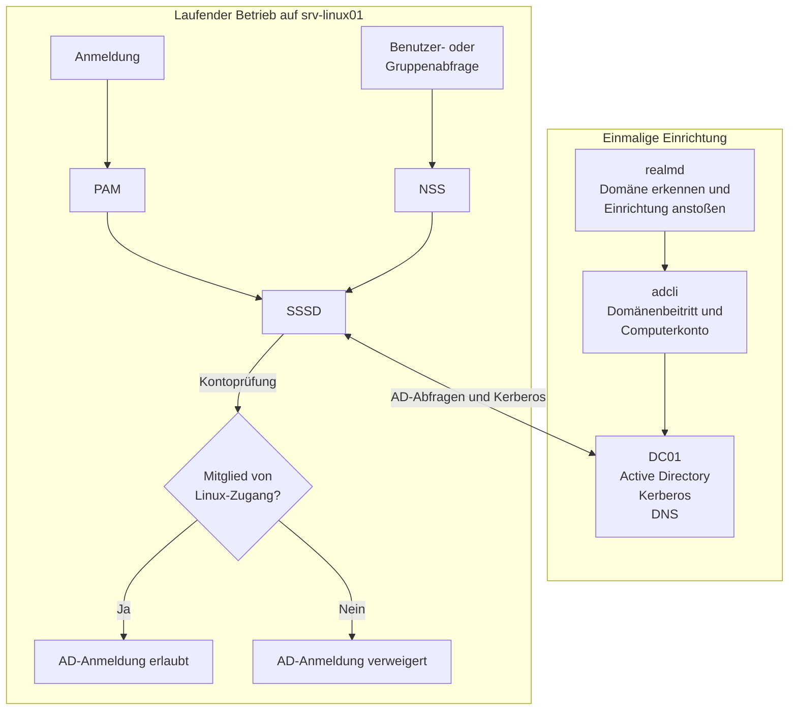

# Active Directory und Linux integrieren

| Punkt | Stand |
|---|---|
| **Technischer Projektumfang** | abgeschlossen |
| **Ziel** | Zentrale Verwaltung von AD-Konten und gruppenbasierter Zugriff auf einen Linux-Server |
| **Beteiligte Systeme** | `DC01` und `srv-linux01` |
| **Domäne** | `ad.dgopslab.test` |
| **Ergebnis** | Domänenbeitritt, AD-Auflösung und Zugriffskontrolle funktionieren auch nach einem Neustart |

## Inhalt

- [Projektziel](#projektziel)
- [Architektur](#architektur)
- [Netzwerk und Namensauflösung](#netzwerk-und-namensauflösung)
- [Active-Directory-Struktur](#active-directory-struktur)
- [Linux-Domänenintegration](#linux-domänenintegration)
- [Gruppenbasierte Zugriffskontrolle](#gruppenbasierte-zugriffskontrolle)
- [Troubleshooting](#troubleshooting)
- [Tests und Ergebnis](#tests-und-ergebnis)
- [Grenzen und mögliche Erweiterungen](#grenzen-und-mögliche-erweiterungen)
- [Quellen](#quellen)

## Projektziel

Für das Homelab sollte eine zentrale Identitätsverwaltung mit Active Directory und eine gruppenbasierte Zugriffssteuerung für einen Linux-Server aufgebaut werden.

`DC01` stellt dazu Active Directory und den zugehörigen DNS-Dienst bereit. Der Ubuntu-Server `srv-linux01` sollte Mitglied der Domäne werden und AD-Benutzer sowie AD-Gruppen auflösen können.

Die Anmeldung mit einem AD-Konto sollte nicht für alle Domänenbenutzer möglich sein. Zugriff erhalten nur Mitglieder der Gruppe `Linux-Zugang`. Ein lokaler administrativer SSH-Zugang bleibt als Rückfallmöglichkeit bestehen.

## Architektur

`realmd` erkennt die Domäne und stößt die Einrichtung an. `adcli` führt den eigentlichen Domänenbeitritt aus und arbeitet dabei mit dem Computerkonto.

Im laufenden Betrieb ist PAM (Pluggable Authentication Modules) an der Anmeldung und Kontoprüfung beteiligt. NSS (Name Service Switch) löst Benutzer und Gruppen auf. Beide verwenden dafür SSSD.



Bei der einmaligen Einrichtung erkennt `realmd` die Domäne über DNS und stößt den Join an. `adcli` führt den eigentlichen Beitritt aus und legt beziehungsweise aktualisiert das Computerkonto und die lokale Kerberos-Keytab.

Im laufenden Betrieb sind `realmd` und `adcli` nicht Teil des normalen Anmeldepfads. SSSD verbindet den Linux-Server mit den benötigten AD-Diensten. DNS sorgt dafür, dass diese Dienste gefunden werden können. Kerberos übernimmt die Authentifizierung.

## Netzwerk und Namensauflösung

`srv-linux01` verwendet eine feste Netzwerkkonfiguration:

| Einstellung | Wert |
|---|---|
| IPv4-Adresse | `192.168.122.20/24` |
| Gateway | `192.168.122.1` |
| DNS-Server | `192.168.122.10` |
| DNS-Suchdomäne | `ad.dgopslab.test` |
| vollständiger Hostname | `srv-linux01.ad.dgopslab.test` |

`192.168.122.10` ist die Adresse von `DC01` und auf `srv-linux01` als einziger DNS-Server eingetragen.

Das ist für die Domänenintegration wichtig, weil Active Directory seine Dienste über DNS-Einträge bekannt macht. Der Linux-Server muss diese Einträge über den AD-DNS-Server finden können.

Die interne Namensauflösung sowie die benötigten Host- und Dienstabfragen wurden geprüft. Auch die externe Namensauflösung über den DNS-Dienst von `DC01` funktionierte im bestätigten Projektstand.

## Active-Directory-Struktur

Für die AD-Struktur wurden Organizational Units (OU, Organisationseinheiten) verwendet. Unterhalb einer gemeinsamen OU für das Homelab wurden getrennte Bereiche für Benutzer, Gruppen und Systeme eingerichtet.

Das Computerkonto von `srv-linux01` liegt in der vorgesehenen Server-OU:

```text
OU=Server,OU=Systeme,OU=DGOPSLAB,DC=ad,DC=dgopslab,DC=test
```

Für die Zugriffskontrolle wurde die globale Sicherheitsgruppe `Linux-Zugang` angelegt.

Die Anmeldung wurde rollenbezogen getestet:

- Ein berechtigter AD-Testbenutzer ist Mitglied von `Linux-Zugang`.
- Ein nicht berechtigter AD-Testbenutzer ist kein Mitglied von `Linux-Zugang`.

Die konkreten Kontonamen sind für das öffentliche Verständnis nicht erforderlich.

## Linux-Domänenintegration

Vor dem Join wurde geprüft, ob `srv-linux01` die Domäne über DNS erkennen kann:

```bash
realm -v discover ad.dgopslab.test
```

Die Discovery war erfolgreich.

Für die Linux-Integration werden mehrere Komponenten verwendet:

- `realmd` erkennt die Domäne und stößt die Einrichtung beziehungsweise den Join an.
- `adcli` führt den eigentlichen Domänenbeitritt aus und arbeitet mit dem Computerkonto.
- SSSD verbindet `srv-linux01` im laufenden Betrieb mit den benötigten AD-Diensten.
- NSS löst AD-Benutzer und AD-Gruppen auf.
- PAM ist an der Anmelde- und Kontoprüfung beteiligt.
- Kerberos übernimmt die Authentifizierung.

Der Domänenbeitritt wurde für die vorgesehene Server-OU durchgeführt. Anschließend zeigte `realm list` unter anderem:

```text
configured: kerberos-member
server-software: active-directory
client-software: sssd
```

Das Computerkonto wurde auf `DC01` in der vorgesehenen OU gefunden. SSSD war aktiv und AD-Konten konnten auf `srv-linux01` aufgelöst werden.

Beim Join wurde außerdem die lokale Datei `/etc/krb5.keytab` angelegt. Ihre Inhalte wurden weder angezeigt noch dokumentiert.

## Gruppenbasierte Zugriffskontrolle

Die AD-Anmeldung wurde auf die Sicherheitsgruppe `Linux-Zugang` beschränkt:

```bash
realm permit -g 'linux-zugang@ad.dgopslab.test'
```

Die anschließende Kontrolle mit `realm list` zeigte:

```text
login-policy: allow-permitted-logins
permitted-groups: linux-zugang@ad.dgopslab.test
```

Einzelne AD-Benutzer wurden nicht direkt freigegeben. Die Zugriffsentscheidung erfolgt über die Gruppe.

Ein berechtigter AD-Testbenutzer wurde einschließlich seiner Mitgliedschaft in `Linux-Zugang` aufgelöst und konnte sich per SSH anmelden.

Bei einem nicht berechtigten AD-Testbenutzer ergab die SSSD-/PAM-Prüfung:

```text
pam_acct_mgmt: Permission denied
```

Der anschließende praktische SSH-Test wurde ebenfalls abgewiesen. Der lokale administrative SSH-Rückfallzugang blieb weiterhin funktionsfähig.

## Troubleshooting

Beim Domänenbeitritt traten zwei getrennte Probleme im Zusammenhang mit Kerberos auf: zuerst fehlte die Kerberos-Grundkonfiguration, später schlug die Authentifizierung des Join-Kontos fehl.

### 1. Fehlender Kerberos-Standard-Realm

**Symptom**

Der erste Join-Versuch brach mit folgender Meldung ab:

```text
Configuration file does not specify default realm
```

Zusätzlich erschien eine Meldung über unzureichende Berechtigungen. Es gab jedoch keinen bestätigten Hinweis darauf, dass fehlende Kontorechte die eigentliche Ursache waren.

**Diagnose**

Der Domänencontroller war erreichbar. Auf `srv-linux01` fehlte zu diesem Zeitpunkt aber die Datei `/etc/krb5.conf`.

Kerberos wusste deshalb nicht, welchen Realm es standardmäßig verwenden sollte. In diesem Homelab ist das `AD.DGOPSLAB.TEST`.

**Ursache**

Es war kein Kerberos-Standard-Realm konfiguriert.

**Korrektur**

Die Kerberos-Konfiguration wurde eingerichtet. Der relevante Teil lautete:

```ini
[libdefaults]
default_realm = AD.DGOPSLAB.TEST
rdns = false
```

**Prüfung**

Die Meldung über den fehlenden Standard-Realm trat danach nicht mehr auf. Ein späteres Authentifizierungsproblem wurde getrennt geprüft.

### 2. Kerberos-Authentifizierung des Join-Kontos

**Symptom**

Ein späterer Test mit `kinit` schlug fehl, obwohl die Kerberos-Konfiguration inzwischen vorhanden war.

**Diagnose**

Auf `DC01` wurde geprüft, ob das Join-Konto aktiv oder gesperrt war und ob das Kennwort abgelaufen war. Diese Prüfungen ergaben keinen solchen Kontofehler.

Das Kennwort des Join-Kontos war jedoch nicht mehr sicher bekannt.

**Ursache**

Das für den Kerberos-Test verwendete Kennwort konnte nicht mehr sicher bestätigt werden.

**Korrektur**

Das Kennwort des Join-Kontos wurde auf `DC01` neu gesetzt. Das Kennwort selbst wird nicht dokumentiert.

**Prüfung**

`kinit` funktionierte anschließend. Danach war auch der Domänenbeitritt erfolgreich.

Damit blieben beide Fehler klar getrennt:

1. Beim ersten Join fehlte die Kerberos-Konfiguration.
2. Beim späteren Kerberos-Test war das Kennwort des Join-Kontos nicht mehr sicher bekannt.

Es wurde jeweils zuerst die festgestellte Ursache korrigiert und danach erneut geprüft.

## Tests und Ergebnis

| Prüfbereich | Bestätigtes Ergebnis |
|---|---|
| DNS und Kerberos | AD-Host- und Diensteinträge wurden aufgelöst; die Kerberos-Authentifizierung war nach der Korrektur erfolgreich. |
| Domänenbeitritt | `srv-linux01` trat der Domäne bei; das Computerkonto liegt in der vorgesehenen Server-OU. |
| Benutzer- und Gruppenauflösung | Der berechtigte AD-Testbenutzer und seine Mitgliedschaft in `Linux-Zugang` wurden erkannt. |
| Zugriff über `Linux-Zugang` | `realm list` zeigte die gruppenbasierte Freigabe und keine einzeln erlaubten AD-Benutzer. |
| Positiv- und Negativtest | Der berechtigte AD-Testbenutzer konnte sich anmelden; der nicht berechtigte AD-Testbenutzer wurde abgewiesen. |
| Lokaler Rückfallzugang | Der lokale administrative SSH-Zugang funktionierte weiterhin. |
| Neustarttest | SSSD, Domänenmitgliedschaft, AD-Auflösung und Zugriffskontrolle blieben nach dem Neustart erhalten. |
| Abschlussprüfung auf `DC01` | `dcdiag /q` lieferte keine Ausgabe und meldete damit bei dieser Prüfung keine Fehler. |

Zusätzlich wurde geprüft, dass `/etc/sssd/sssd.conf` und `/etc/krb5.keytab` `root:root` gehören und mit `600` geschützt sind. Inhalte der Keytab wurden nicht ausgelesen.

Der definierte technische Umfang des Teilprojekts ist damit abgeschlossen. Das übergeordnete Homelab wird weiter ausgebaut.

## Grenzen und mögliche Erweiterungen

Der Aufbau ist ein Homelab und nicht unverändert auf eine Produktivumgebung übertragbar.

Bekannte Grenzen sind:

- `DC01` ist der einzige Domänencontroller. Active Directory ist daher nicht hochverfügbar.
- Für Active Directory wurde noch keine unabhängige Sicherungs- und Wiederherstellungsstrategie umgesetzt.
- Der vorhandene VM-Snapshot vor dem Domänenbeitritt ist kein unabhängiges Backup.
- Ein Zurückspielen dieses Snapshots könnte den Zustand von `srv-linux01` und dem AD-Computerkonto auseinanderbringen und darf deshalb nicht unüberlegt erfolgen.
- Die AD-Anmeldung auf `srv-linux01` hängt von der Erreichbarkeit von `DC01`, funktionierendem DNS und ausreichender Zeitsynchronisation ab.
- Für den Join wurde im Homelab das vorhandene Domänenadministratorkonto verwendet. In einer produktiven Umgebung wäre ein entsprechend delegiertes Konto vorzuziehen.

Mögliche spätere Erweiterungen wären ein zweiter Domänencontroller sowie eine unabhängige Sicherungs- und Wiederherstellungsstrategie. Diese Punkte gehören nicht zum abgeschlossenen technischen Umfang dieses Teilprojekts.

## Quellen

- [Microsoft Learn – Install Active Directory Domain Services (Level 100)](https://learn.microsoft.com/en-us/windows-server/identity/ad-ds/deploy/install-active-directory-domain-services--level-100-) – abgerufen am 10.09.2026.
- [Microsoft Learn – Best practices for DNS client settings in Windows Server](https://learn.microsoft.com/en-us/troubleshoot/windows-server/networking/best-practices-for-dns-client-settings) – abgerufen am 10.09.2026.
- [Ubuntu Server – How to set up SSSD with Active Directory](https://ubuntu.com/server/docs/how-to/sssd/with-active-directory/) – abgerufen am 12.09.2026.
- [Ubuntu Manpages – realmd.conf: Tweak behavior of realmd](https://manpages.ubuntu.com/manpages/noble/man5/realmd.conf.5.html) – abgerufen am 12.09.2026.
